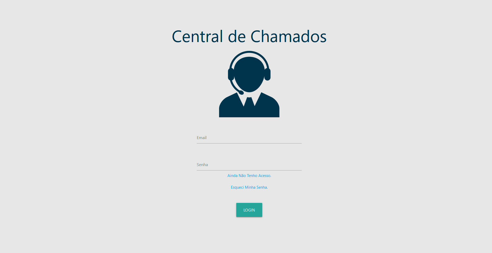
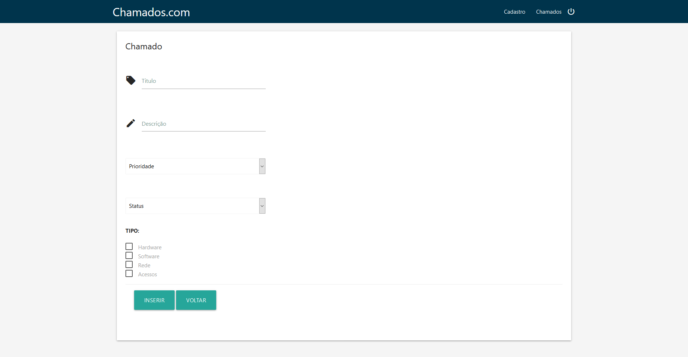
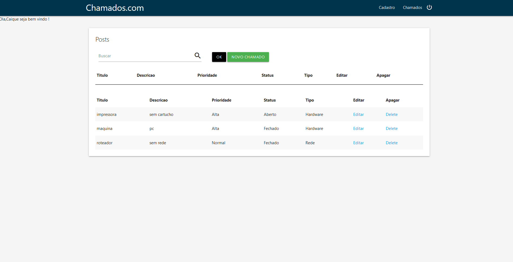
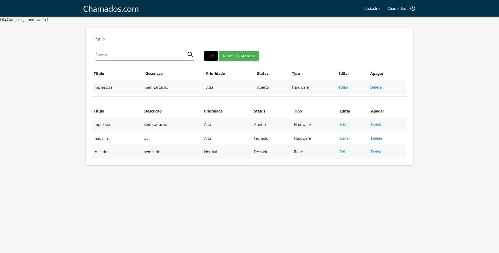

<h1>Desenvolvimeno de um Sistema de Abertura de Chamado</h1>

O objetivo deste projeto é desenvolver um sistema de chamado que permita a formalização, acompanhamento e resolução de solicitações enviadas pelos usuários de maneira ágil e eficiente. O sistema visa proporcionar uma interface intuitiva, onde os usuários possam registrar suas demandas, acompanhar o status dos chamados e receber feedback em tempo real. Para os gestores e equipes de suporte, a ferramenta terá funcionalidades que facilitem a triagem, priorização e resolução das solicitações.

<h2>Linguagens e Bibliotecas Utilizadas</h2>

  

<h2>HTML(HyperText Markup Language)</h2>

É a linguagem de marcação padrão utilizada para criar e estruturar páginas da web. Ela define a estrutura do conteúdo na internet, permitindo que elementos como textos, imagens, links e vídeos sejam organizados e apresentados de forma adequada em navegadores

<h2>CSS(Cascading Style Sheets)</h2>

CSS é uma linguagem utilizada para estilizar e formatar a apresentação de páginas web.

<h2>Javascript</h2>

JavaScript é uma linguagem de programação de alto nível, interpretada e orientada a objetos, amplamente utilizada para o desenvolvimento de aplicações web, além de ser usada para manipular elementos da interface do usuário, JavaScript também é empregado para validação de formulários, criação de gráficos e animações, interação com APIs e desenvolvimento de aplicativos móveis e desktop, entre outras aplicações.

<h2>Php(Hypertext Preprocessor)</h2>

PHP (Hypertext Preprocessor) é uma linguagem de programação de script do lado do servidor, amplamente utilizada para o desenvolvimento de websites dinâmicos e aplicações web.

<h2>Mysql</h2>

MySQL é um sistema de gerenciamento de banco de dados relacional (RDBMS) que utiliza a linguagem de consulta estruturada (SQL) para acessar e manipular dados.

<h2>Resumo do Projeto</h2>
<h3>Chamados.com Website Made by <a href="https://materializecss.com/">Materialize</a>. </h3>
 

 

 

 

